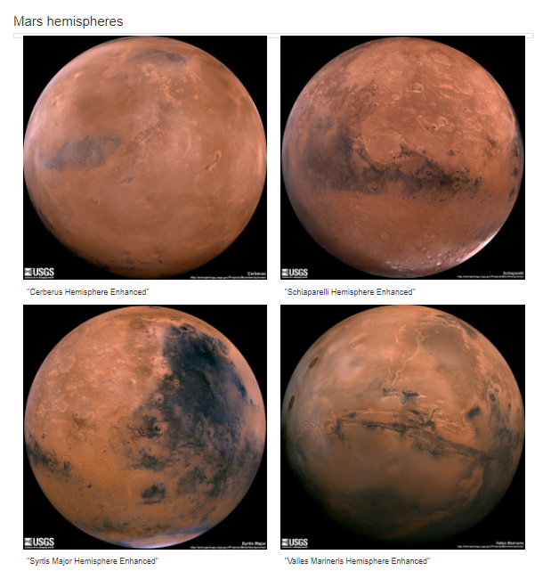
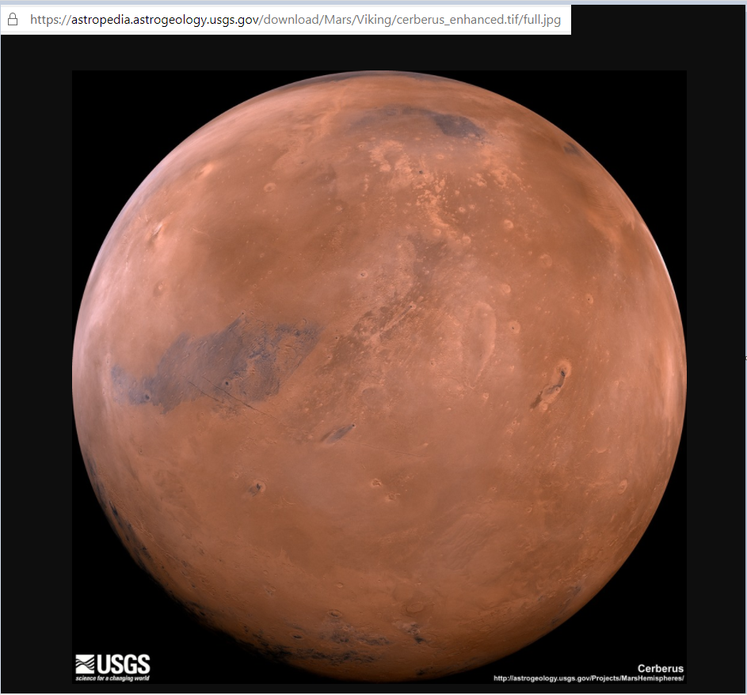

# Mission-to-Mars
UofT - Data analytics - WebScraping

# Overview
Robin had been admiring images of Mars’s hemispheres online and realized that the site is scraping-friendly. She would like to adjust the current web app to include all four of the hemisphere images. To do this, we’ll use BeautifulSoup and Splinter to scrape full-resolution images of Mars’s hemispheres and the titles of those images, store the scraped data on a Mongo database, use a web application to display the data, and alter the design of the web app to accommodate these images.

# Results
We develop the code in Mission_to_Mars_Challenge,ipynb notebook<br>
We first build a list of dictionary elements `hemisphere_image_urls` by scraping from <br>
`https://astrogeology.usgs.gov/search/results?q=hemisphere+enhanced&k1=target&v1=Mars`<br>
We then go through each item in this list to get the related full resoluion jpge image<br>
The function `def jpg_href(url)` returns the url for the related image.<br>
We add the new code as function `def mars_hemisphere(browser)` to the `scraping.py`<br>
Finally we call the function in the `app.py` and modify the `index.html` <br>
We used the bootstrap style sheet for styling the site. Note the use of the thumbnail class for displaying the images on the main page.
```
        <!-- Mars hemisphere -->
        <div class="row" id="mars-hemisphere">
            <h2>Mars hemispheres</h2>
                <div href = "#" class = "thumbnail">
                    
                    <div class = "col-sm-3 col-md-6">
                        <a href="{{hemisphere.img_url}}" class="">
                            
                            <div class="caption">
                                <h4 class="">"{{hemisphere.title}}"</h4>
                            </div>
                        </a>
                    </div>
                    
            </div>
        </div><!-- Mars hemisphere END -->

```
to store the results in the mongodb and display it to the user<br>
<br>
Clicking the hemisphere link will take us to the high resolution image of the image<br>



